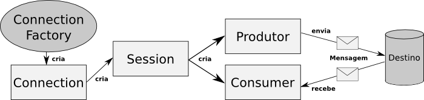

#### Run ActiveMQ local using docker
```shell
docker run --name alura-camel-activemq -p 61616:61616 -p 8161:8161 rmohr/activemq:5.13.0
```

#### Before steps:

1. After container up access http://localhost:8161
2. Login: admin and password: admin
3. Get in Queues menu and create net queue: fila.financeiro
4. Get in Topics menu and create new topic: topico.loja
#### Flow JMS Protocols in ActiveMQ

